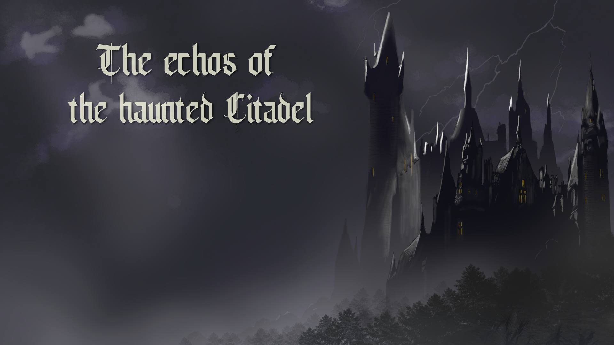

# The echoes of the haunted Citadel

A point & click horror game, product of a group project, in which Engineers, Designers and Artist come together to develop a game in 2 weeks.

   

## Overview

You play as Lily, a spirited young girl, wandering through some woods near your home. You stumble upon a dark castle. Intrigued by the castle's looking silhouette, you cautiously approach the aged wooden gate. You step into the castle's interior, an air of darkness envelops you. You find yourself entrapped and swiftly confined within the castle dungeon, the heavy door ominously locking behind you.

Developed in Processing.

## Features

### Gameplay (Engineers)

- **Item interaction** Pick up from the environment and use them to interact with other prats of the environment
- **Mozaic Puzzle:** Align the mozaic correctly to continue
- **Book Puzzle:** Order the books correctly to continue
- **Sequence Puzzle:** Push the stones in the correct sequence to continue

### UI/UX, SFX, VFX (Designers and Artists)

- **Start and end screen**
- **HUD:**
  1. Inventory
  2. Inventory items
  3. Direction icons
- **Sounds**
  1. Background music
  2. Sound effects

## Controls
  
- **Clicking** You can interact with environment and puzzles by pressing the left mouse button
- **Dragging** You can drag items from the inventory to the environment by holding the left mouse button

## Game Design
Done by: @Luna Nguyen, @Arthur Stam

## Art
Done by: @Finley Murronmaa, @Ivayla Panayotova
